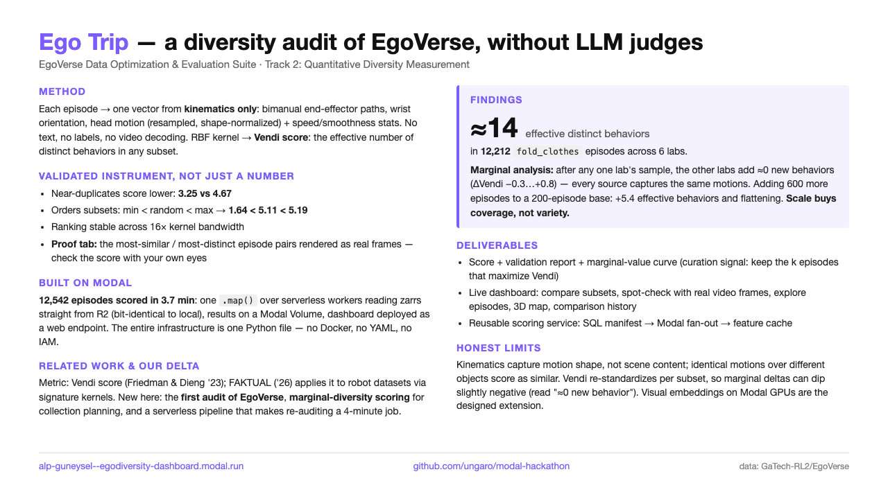
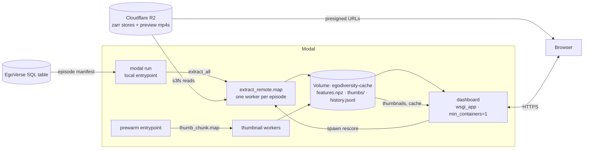
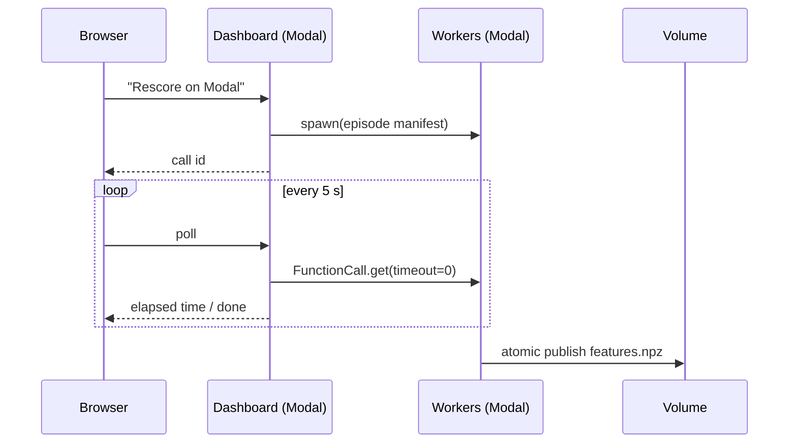

# EgoVerse Data Optimization & Evaluation Suite — Track 2: Quantitative Diversity Measurement

**Live dashboard:** https://alp-guneysel--egodiversity-dashboard.modal.run
**Summary slide:** [`slide.html`](slide.html) (open in a browser)

How diverse is an episode subset, really? This project answers it with a
number, not an LLM judge: kinematic trajectory features → RBF similarity
kernel → **Vendi score** (effective number of distinct behaviors). All
compute runs serverlessly on [Modal](https://modal.com) against the EgoVerse
R2 bucket; the dashboard is a deployed Modal web endpoint.

Headline result: 12,212 `fold_clothes` episodes across 6 labs ≈ **~14
effective distinct behaviors**. Marginal analysis: after any one lab's
episodes, the other labs add ≈0 new behaviors (ΔVendi −0.3…+0.8) — every
source captures the same motions, so scale buys coverage, not variety.

The dashboard lets you check the score with your own eyes: hover any point on
the 3D map or compare scatter to see the episode's actual video frame, play
the full preview video with hand trajectories synced to the video clock, or
open the **Spot check** tab to see the most-similar and most-distinct episode
pairs as contact sheets + inline videos. Plus curated one-click comparisons,
a comparison history log, and a drop zone to **upload your own dataset** (any
`features.npz` — see the package README for the format).

Metric credit: Vendi score ([Friedman & Dieng 2023](https://arxiv.org/abs/2210.02410));
[FAKTUAL](https://arxiv.org/html/2603.11634v1) applies it to robotics datasets
with signature kernels. New here: the first audit of EgoVerse, marginal-diversity
scoring for collection planning, and a serverless pipeline that makes
re-auditing a ~4-minute job.

## How Modal is used

The whole pipeline runs cloud-to-cloud (R2 → Modal → browser); the laptop is
only a dev environment. Everything below is one file:
[`egodiversity/modal_app.py`](egodiversity/modal_app.py).

- **Parallel batch scoring (`Function.map`)** — one worker per episode reads
  its zarr straight from R2 and computes the feature vector.
  12,542 episodes in **3.7 minutes**; per-episode failures return an empty
  blob instead of killing the map (330 robot-embodiment episodes with
  different array keys were skipped this way). Because the feature code ships
  to workers via `add_local_python_source`, remote extraction is
  **bit-identical** (max diff 2e-16) to running the same function locally —
  verified, not assumed.
- **Volume as the system of record** — the feature cache, 12,542 pre-generated
  hover thumbnails, and the comparison-history JSONL all live on one
  `modal.Volume`. Batch jobs write it; the web app reads it. New caches are
  published atomically (temp file → `os.replace` → `commit`) so a dashboard
  cold start mid-rescore never reads a partial file — a race we hit and fixed.
- **Web endpoint (`@modal.wsgi_app`)** — the Dash dashboard is deployed with
  `modal deploy` and served at the `.modal.run` URL. `min_containers=1` keeps
  one container warm (~0.3–0.5 s responses); the container holds the 12k-episode
  feature matrix and PCA in memory.
- **Calling a deployed function from a web request
  (`Function.from_name(...).spawn()`)** — the "Rescore on Modal" button in the
  dashboard spawns a fresh full re-score without blocking the request, and the
  UI polls `FunctionCall.from_id(id).get(timeout=0)` every 5 s to show live
  status. The same code path works from a laptop CLI.
- **Secrets** — R2 credentials go in as a `modal.Secret`, so no keys live in
  the repo or the image.
- **Images as code** — both images (CPU feature workers, dashboard) are plain
  `Image.debian_slim().pip_install(...)` chains. No Dockerfile, no registry,
  no YAML anywhere in the project.

Rough edges we hit, for honesty: `add_local_python_source` must be the last
image build step (Modal enforces this with an opaque-at-first error);
unpinned `s3fs`/`aiobotocore`/`botocore` resolution broke R2 reads inside the
dashboard image until we pinned the set; and Volume writes are not atomic by
default (hence the tmp+rename publish).

See [`egodiversity/README.md`](egodiversity/README.md) for quickstart, design
decisions, and the validation report. EgoVerse dataset:
https://github.com/GaTech-RL2/EgoVerse/
