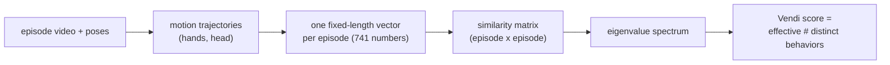
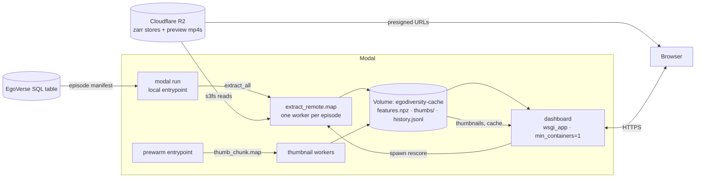
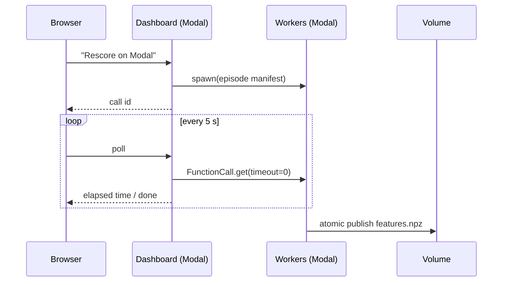
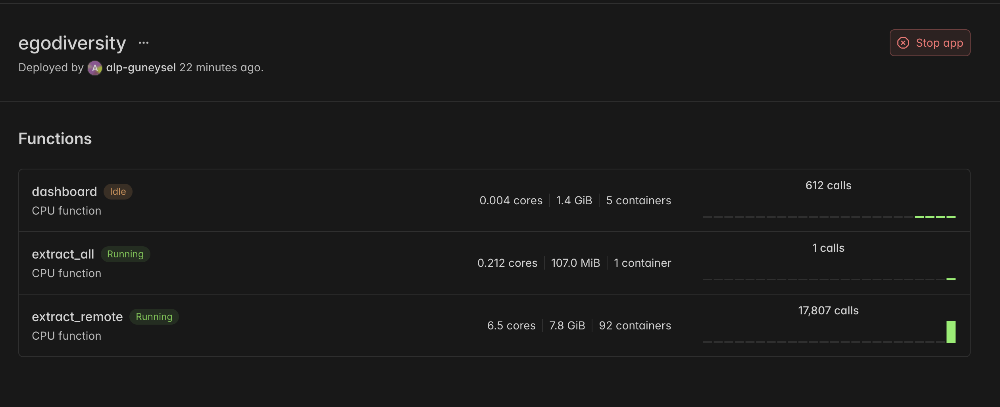

# Ego Trip — EgoVerse Data Optimization & Evaluation Suite, Track 2: Quantitative Diversity Measurement


**Live dashboard:** https://alp-guneysel--egodiversity-dashboard.modal.run

## TL;DR

Robot teams are collecting huge egocentric-video datasets of humans doing
tasks — but more data is not better data, and today nobody can say how much of
a dataset is genuinely new without expensive, subjective LLM judges. **Ego
Trip answers "how many different behaviors are actually in this dataset?" with
one number**, computed from motion trajectories alone (no text, no labels, no
video models), and a live dashboard where you can check the number against the
real videos with your own eyes. Auditing 12,542 episodes takes about 4
minutes, cloud-to-cloud, on Modal.

**Findings from the first quantitative audit of EgoVerse's `fold_clothes`
task** (the pipeline re-runs on any other task in ~4 minutes; fold_clothes is
the pilot, chosen because every lab contributes episodes to it):

- 12,212 `fold_clothes` episodes across 6 labs ≈ **~14 effective distinct
  behaviors** — heavy redundancy.
- After any one lab's episodes, every other lab adds **≈0 new behaviors**
  (ΔVendi −0.3…+0.8) — every source captures the same motions. Scale buys
  coverage, not variety.
- Adding 600 more episodes to a 200-episode base buys +5.4 effective
  behaviors and flattening — the marginal-value curve tells you when to stop
  collecting.

**What are those ~14 behaviors?** The Vendi score gives a count, not labels —
but a post-hoc k-means sketch (k=14, standardized features) shows the modes.
Every row's representative episode can be pasted into the dashboard's
Explore tab to watch it:

| share of 12,212 episodes | dominant labs | median frames | representative episode |
|---|---|---|---|
| 15.5% | microagi | 346 | `2026-04-30-19-15-19-015184` |
| 12.3% | microagi | 216 | `2026-06-09-08-49-18-849166` |
| 11.7% | microagi | 310 | `2026-05-30-08-10-37-716336` |
| 8.5% | microagi | 351 | `2026-06-19-06-00-44-592508` |
| 7.9% | microagi | 421 | `2026-06-03-08-27-21-617531` |
| 6.2% | mecka | 195 | `692eb64eba0400c7068a002d` |
| 5.8% | microagi | 463 | `2026-05-22-14-27-17-156158` |
| 5.7% | microagi | 462 | `2026-05-04-20-47-54-980070` |
| 5.1% | mecka | 192 | `692ea90de2322e3b092b5f09` |
| 4.9% | microagi | 480 | `2026-06-03-14-53-54-489127` |
| 4.9% | microagi | 366 | `2026-06-19-06-37-01-150801` |
| 4.8% | microagi/mecka | 323 | `2026-06-01-09-35-37-967967` |
| 4.0% | rl2/eth | 2650 | `2025-10-15-20-26-47-000000` |
| 2.7% | rl2 | 2514 | `2025-11-23-19-42-53-057000` |

Two honest observations from the table: every lab's episodes land in the
*same* top modes (the cross-lab redundancy, made visible), and the two
rl2/eth-dominated clusters are largely "long sessions" (median ~2,500 frames
vs ~200–480 elsewhere) — duration and speed are part of the feature vector,
so recording style is one of the axes the score sees.

**Findings that did not exist before today** (EgoVerse is weeks old; none of
this is in any paper):

- **An "episode" is not the same object across labs.** Median episode length
  is ~6.5 s at mecka (195 frames) but ~90–115 s at rl2/eth/song/wang
  (~2,400–3,400 frames) — a 15× difference in what one training example
  *is*. microagi sits at ~11 s. Anyone mixing these sources for training is
  mixing short clips with full sessions, whether they know it or not.
- **Redundancy without duplicates.** Only 5% of episodes have a near-twin
  (nearest-neighbor distance < 0.25× the median pairwise distance). The
  dataset isn't padded with copy-paste recordings — it's thousands of
  *independent* recordings converging on the same small set of motions.
  Deduplication tools would find almost nothing here; the redundancy is
  behavioral, and only a behavior-level metric can see it.
- **Farthest-point sampling doesn't work here.** The standard
  "pick a diverse subset" heuristic (k-center) scores no better than random
  under Vendi in this 741-dim feature space (5.10 vs 5.11) — distances
  concentrate in high dimensions, so the selector has to optimize the
  diversity metric directly.

## How it works



1. **Kinematic features, no pixels.** Each episode records the hands' and
   head's positions over time — e.g. the right hand is a path of N points
   `p₁…pₙ` in 3-D space (N ≈ 2,700 for a ~90 s clip). We turn that path into
   a fixed-length description of its **shape**:

   ```
   resample:   qᵢ = the hand's position at 64 evenly spaced moments
                    (linear interpolation — a 30 s clip and a 3 min clip
                    both get exactly 64 "beats")
   center:     q̂ᵢ = qᵢ − q₁        (shift the path to start at the origin)
   scale:      vᵢ = q̂ᵢ / s,  s = sqrt(mean ‖q̂ᵢ‖²)   (divide by its own extent)
   flatten:    v₁…v₆₄ → 192 numbers
   ```

   Centering makes the description independent of *where* in the room the
   motion happened; scaling makes it independent of *how big* the workspace
   was. Two episodes of the same folding motion at different tables land on
   nearly the same vector; genuinely different motions land far apart. The
   same recipe runs on the left hand (192 numbers), the wrist orientation
   (256), and the head path (96); then we append 5 summary stats computed on
   the *raw* path (path length, duration, mean/std speed, jerk) so absolute
   scale isn't thrown away. Total: **741 numbers per episode**. No video
   decoding, no annotations.
2. **Similarity → one number.** We compare every pair of episodes with an
   **[RBF kernel](https://en.wikipedia.org/wiki/Radial_basis_function_kernel)** — a smooth
   similarity function that returns ~1 when two
   motion vectors are nearly identical and fades toward 0 the farther apart
   they are (one bandwidth knob sets how quickly "similar" decays to
   "different"; we set it from the data's own median distance, and show that
   rankings don't depend on the choice). The **[Vendi score](https://github.com/vertaix/vendi-score)** then reads the
   shape of that similarity web: the effective number of distinct behaviors
   in any subset (k identical episodes score ~1; k mutually dissimilar score ~k).
3. **A validated instrument, not just a number.** The score passes four
   behavioral tests before any dataset claim is made: near-duplicate subsets
   score lower (3.25 vs 4.67), subset ordering is correct
   (greedy-min 1.64 < random 5.11 < greedy-max 5.19), rankings are stable
   across a 16× kernel-bandwidth range, and the score saturates as redundant
   episodes are added. Full report:
   [`egodiversity/report/validation_report.md`](egodiversity/report/validation_report.md).

**Related work, honestly:** the metric is the Vendi score
([Friedman & Dieng 2023](https://arxiv.org/abs/2210.02410));
[FAKTUAL](https://arxiv.org/html/2603.11634v1) applies it to robotics datasets
with signature kernels. New here: the first audit of EgoVerse,
marginal-diversity scoring for collection planning, and a serverless pipeline
that makes re-auditing a ~4-minute job.

**Limits:** kinematics capture motion shape, not scene content — identical
motions over different objects score as similar. Adding visual embeddings
(Modal GPUs, one more feature block) is the designed extension.

## The dashboard

One deployed page, six tabs:

- **Compare** — pick two subsets (by lab, strategy, size — or a curated
  one-click comparison like "Does 20× data mean 20× diversity?") and get the
  Vendi scores plus a plain-English verdict. Hover any point in the PCA
  scatter to see that episode's actual video frame.
- **Spot check** — the proof tab: the most-similar and most-distinct episode
  pairs in your subset, rendered as contact sheets + inline videos, so the
  score can be checked against reality.
- **Explore episodes** — full preview video with 3D hand trajectories whose
  markers track the video clock.
- **3D map** — all 12,212 episodes as a WebGL point cloud, colored by lab,
  hover for video thumbnails.
- **History** — every comparison is logged, so audits are reviewable.
- **How it works** — the method in plain English.

## Explore your dataset

The dashboard isn't EgoVerse-specific — drop any `features.npz` onto the
upload box in the header and every tab switches to your data instantly
(scores, curated comparisons, PCA maps, history). The format is deliberately
simple: an `(n_episodes, n_features)` float array plus one metadata dict per
episode (`episode_id` required; `lab`, `task_name`, `num_frames`, and `path`
optional — `path` enables video/thumbnail previews). Three ways to get one:

1. **Any features you already have** — write the npz yourself:
   `np.savez("my.npz", features=X, metadata=json.dumps(metas))`, then drop it
   on the dashboard.
2. **EgoVerse-format zarrs on disk** — `python -m egodiversity.features
   --data-dir <dir> --out my.npz` builds the file (kinematic features, ~1 min
   per 100 episodes).
3. **Episodes on S3/R2 at scale** — a manifest JSON of episode paths, then
   `modal run -m egodiversity.modal_app --manifest <file>` fans the
   extraction out on Modal and publishes a new cache the dashboard can serve.

Want to try the upload right now? Grab
[`egodiversity/cache/demo_mecka_tasks.npz`](egodiversity/cache/demo_mecka_tasks.npz)
— 449 episodes across 8 different mecka tasks (bottling perfume, assembling
pens, brushing shoes, carving wood…), extracted on Modal in 46 s. Drop it on
the dashboard and compare tasks against each other (the "lab" pools are the
task names).

## How Modal is used

The workload is bursty, embarrassingly parallel, and interactive — the shape
Modal is built around. The whole pipeline runs cloud-to-cloud (R2 → Modal →
browser); the laptop is only a dev environment. Everything below is one file:
[`egodiversity/modal_app.py`](egodiversity/modal_app.py).



- **Parallel batch scoring (`Function.map`)** — one worker per episode reads
  its zarr straight from R2 and computes the feature vector.
  12,542 episodes in **3.7 minutes**; per-episode failures return an empty
  blob instead of killing the map (330 robot-embodiment episodes with
  different array keys were skipped this way). Because the feature code ships
  to workers via `add_local_python_source`, remote extraction is
  **bit-identical** (max diff 2e-16) to running the same function locally —
  verified, not assumed.
- **Volume as the system of record** — the feature cache, 12,542 pre-generated
  hover thumbnails, and the comparison-history JSONL all live on one
  `modal.Volume`. Batch jobs write it; the web app reads it. New caches are
  published atomically (temp file → `os.replace` → `commit`) so a dashboard
  cold start mid-rescore never reads a partial file — a race we hit and fixed.
- **Web endpoint (`@modal.wsgi_app`)** — the Dash dashboard is deployed with
  `modal deploy` and served at the `.modal.run` URL. `min_containers=1` keeps
  one container warm (~0.3–0.5 s responses); the container holds the 12k-episode
  feature matrix and PCA in memory.
- **Calling a deployed function from a web request
  (`Function.from_name(...).spawn()`)** — the "Rescore on Modal" button in the
  dashboard spawns a fresh full re-score without blocking the request, and the
  UI polls `FunctionCall.from_id(id).get(timeout=0)` every 5 s to show live
  status. The same code path works from a laptop CLI.
- **Secrets** — R2 credentials go in as a `modal.Secret`, so no keys live in
  the repo or the image.
- **Images as code** — both images (CPU feature workers, dashboard) are plain
  `Image.debian_slim().pip_install(...)` chains. No Dockerfile, no registry,
  no YAML anywhere in the project.



A rescore fanning out in the Modal console — 92 containers spawned from one
button click in the dashboard:



What you're looking at: a **rescore** recomputes every episode's
motion-shape feature vector by reading its zarr from R2. The **fan-out** is
Modal running that as ~92 parallel containers (the `extract_remote` row:
17,807 calls, 6.5 cores, 7.8 GiB in flight) instead of one sequential loop —
which is why 12.5k episodes finish in under 4 minutes. The other two rows are
the project itself: `dashboard` (this web app, idle between page loads) and
`extract_all` (the coordinator that hands episode lists to the workers).

Rough edges we hit, for honesty: `add_local_python_source` must be the last
image build step (Modal enforces this with an opaque-at-first error);
unpinned `s3fs`/`aiobotocore`/`botocore` resolution broke R2 reads inside the
dashboard image until we pinned the set; and Volume writes are not atomic by
default (hence the tmp+rename publish).

One build day on Modal, by the numbers (`modal app history`, the console
screenshot above, and the volume itself):

- **16 deployments**, each tied to a git commit — iterate-to-prod in ~2 s per
  redeploy
- **Container image builds**: ~30–45 s from scratch after a dependency change
  (full pip resolve + install of the dashboard/worker image), ~1.5–2 s when
  layers are cached — measured across 16 deploys today
- **~25,000 `extract_remote` calls** (two full 12,542-episode scoring passes
  plus smoke tests)
- **92 containers running concurrently** at peak fan-out
- **12,542 thumbnails** generated by one parallel prewarm job (~8 min) and
  served from the Volume
- **1 warm dashboard container**, ~0.3–0.5 s responses

## Links

- Package README — quickstart, design decisions, validation details:
  [`egodiversity/README.md`](egodiversity/README.md)
- EgoVerse dataset: https://github.com/GaTech-RL2/EgoVerse/
